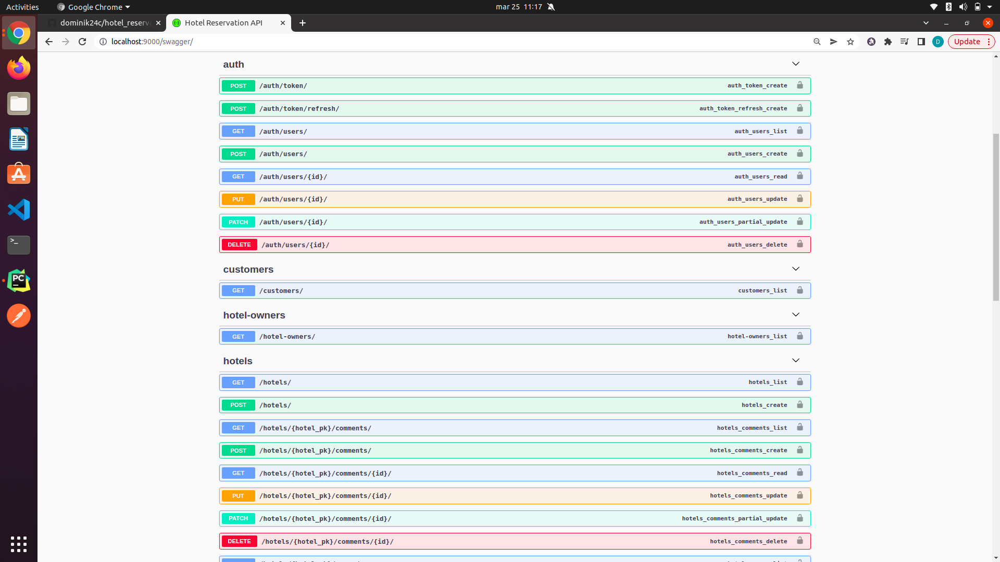

# Hotel Reservation
It's rest api web application. Website allows creating two types of user: customer and hotel owner.
Hotel owner can make crud operations on hotel, rooms models. Customer can make crud operations on 
comments and reservation models.

## Usage
First create .env file inside web directory and create environment variables like below
```dotenv
SECRET_KEY='SECRET_KEY'
DEBUG=True
POSTGRES_HOST=db
POSTGRES_USER=user01234
POSTGRES_PASSWORD=Secret123
POSTGRES_DB=hotel
```
Run application by using the commands below:
```bash
sudo docker-compose build
sudo docker-compose run web python3 manage.py migrate
sudo docker-compose run web python3 manage.py init_groups
sudo docker-compose run web python3 manage.py collectstatic
sudo docker-compose up -d
```

## Testing 
```bash
sudo docker-compose run web python3 manage.py test
```

## View



